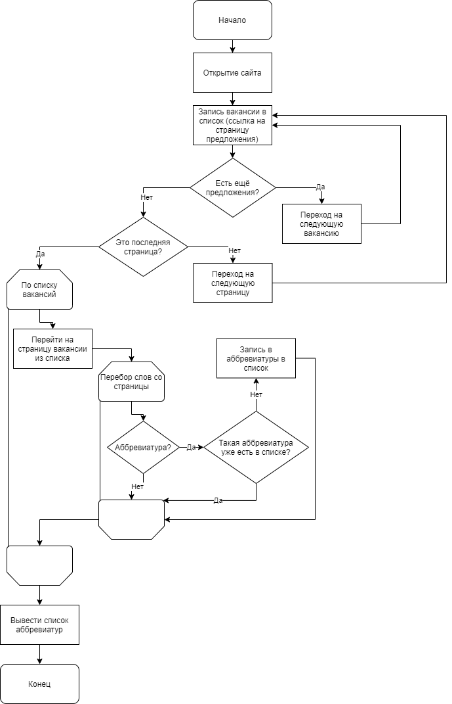

# Проект "Pars"
Казаков Егор 9Е
Руководитель: Гусев Антон
Заказчик: Жигулёв Александр

Целью проекта является написание программы,
для поиска аббривиатур на изначально выбранном 
сайте для поиска вакансий программиста

---
### Инструменты
- Python
- Bs4 (BeautifulSoup)
- Selenium 

---
### Работа
1) Запуск программы
2) Программа открывает сайт 
3) Считывание данных со страницы и запись 
каждой вакансии в список с сылкой на страницу предложения
4) Переход на страницу записанную в список
5) Поиск и запись в список найденных аббривиатур

---
### Структура

---
### Требования
- Windows
- Python 3 и новее
- Возможно установленные библиотеки
- Chrome 95.0.4638.69

